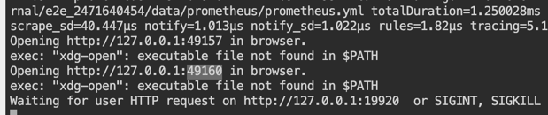

This is interactive playground.

Please follow task in [slides](https://docs.google.com/presentation/d/1-LauyQqDQD5a1oAk16Ke03uKGwgH5UT0hBuy7aIwJIg/edit).

NOTE: Make sure to copy the main.go modification you do on the way, otherwise you will lose it (killercoda shutdowns after ~1h),

Particularly:

1. Clone client_golang

    ```
    git clone git@github.com:prometheus/client_golang.git
    ```{{exec}}
   
2. Go to whatup dir:

    ```
    cd client_golang/tutorial/whatsup
    ```{{exec}}
   
3. Run Prometheus and Jaeger in Background:

    ```
    make init
    ```{{exec}}

(make stop to stop it)

In killercoda this will not open UI, but instead print network address of Jaeger and Prometheus (in order):



To access those, copy the port of Jaeger or Prometheus (e.g. `Opening http://127.0.0.1:49160 in browser`, but ports are dynamic) and put into port field in [ACCESS PORTS]({{TRAFFIC_SELECTOR}})

4. Modify and run main.go

    ```
    export WHATSUPADDR={{TRAFFIC_HOST1_99}}
    make run
    ```{{exec}}

(Ctrl+C to stop it)

Now you can in separate terminal:

* Get main.go metrics to explore or [in browser]({{TRAFFIC_HOST1_99}})

    ```
    make metrics
    ```{{exec}}

* Open Prometheus UI and query metrics (as mentioned before).
* Run acceptance tests to verify your progress.

    ```
    make test
    ```{{exec}}


## Task

Modify main.go to have:

- Scrape Endpoint
- whatsup_queries_handled_total (counter)
- whatsup_last_response_elements (gauge)
- build_info (info gauge)
- whatsup_queries_duration_seconds (histogram)
- go_goroutines (gauge)
